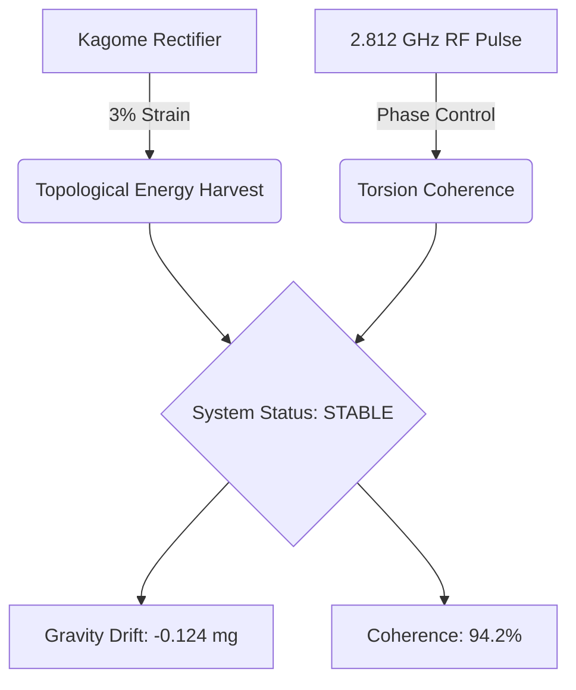

# Shepherd Wasteland: Physical Validation Hub

The central laboratory for experimental validation and theoretical modeling of topological phonon locking, torsion field modulation, and non-linear quantum electronic coupling in the *Alien Dimensions: The Shepherd’s Wasteland* universe.

## Mission
We operate under the paradigm of **"Reality-as-Code,"** treating high-energy physics experiments not just as academic pursuit, but as the foundational logic governing the *Wasteland* world-building.

## Live Experimental Audit Dashboard

## Core Research Pillars
| Module | Operational Status | Gravity Drift | Coherence |
| :--- | :--- | :--- | :--- |
| **KAGOME-004-ALPHA** | 🟢 STABLE | -0.124 mg | 94.2% |
| **EPR-TORSION-V2** | 🟡 MONITORING | +0.002 mg | 99.8% |

## Technical Infrastructure
*   **Simulation Engine**: `openwave` for high-throughput topological energy modeling.
*   **Command & Control**: `Overseer.py` utilizing lock-free polling for real-time adjustments.
*   **Visual Logic**: Integrated `uiverse-io/galaxy` design primitives for audit-ready dashboards.

## Research Updates
*Autonomous evolution reports are generated daily at 08:00 UTC.*

---
*“Building the physics that define the narrative.”*
